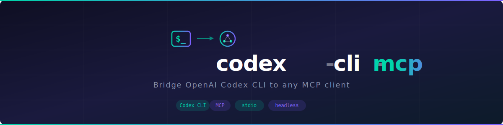

<div align="center">

<picture>
  
</picture>

### Bridge OpenAI Codex CLI to any MCP client

English | [한국어](./README.ko.md)

<a href="https://www.npmjs.com/package/@nayagamez/codex-cli-mcp">npm</a> · <a href="https://github.com/nayagamez/codex-cli-mcp">GitHub</a> · <a href="https://github.com/nayagamez/codex-cli-mcp/issues">Issues</a>

[](https://www.npmjs.com/package/@nayagamez/codex-cli-mcp)
[](https://github.com/nayagamez/codex-cli-mcp/blob/main/LICENSE)
[](https://github.com/nayagamez/codex-cli-mcp)

</div>

---

## Overview

An MCP (Model Context Protocol) server that wraps [OpenAI Codex CLI](https://github.com/openai/codex) as tools. It enables MCP clients like **Claude Desktop**, **Cursor**, and **Windsurf** to run Codex CLI sessions in headless mode.

## Prerequisites

### 1. Install Codex CLI

Install [Codex CLI](https://github.com/openai/codex) ([docs](https://developers.openai.com/codex/cli)) and make sure it is available in your PATH:

```bash
# npm
npm install -g @openai/codex

# Homebrew (macOS)
brew install --cask codex
```

Or download the binary from [GitHub Releases](https://github.com/openai/codex/releases/latest).

### 2. Authenticate

**Option A — ChatGPT Login (Recommended)**

Run `codex` and select "Sign in with ChatGPT". Requires a Plus, Pro, Team, Edu, or Enterprise plan.

**Option B — API Key**

For headless / CI environments:

```bash
export OPENAI_API_KEY="your-api-key"
```

See the [Codex Authentication docs](https://developers.openai.com/codex/auth/) for more details.

## Tools

### `codex`

Start a new Codex CLI session.

| Parameter | Type | Required | Description |
|-----------|------|----------|-------------|
| `prompt` | string | Yes | The prompt to send to Codex |
| `model` | string | No | Model name (e.g. `o4-mini`, `gpt-4.1`, `o3`) |
| `sandbox` | enum | No | `read-only`, `workspace-write`, or `danger-full-access` |
| `cwd` | string | No | Working directory for the session |
| `profile` | string | No | Configuration profile from config.toml |
| `config` | object | No | Config overrides as key-value pairs |
| `timeout` | number | No | Timeout in ms (default: `600000` = 10 min) |

### `codex-reply`

Continue an existing Codex CLI session.

| Parameter | Type | Required | Description |
|-----------|------|----------|-------------|
| `prompt` | string | Yes | The follow-up prompt |
| `threadId` | string | Yes | Thread ID from a previous `codex` call |
| `model` | string | No | Model name override |
| `config` | object | No | Config overrides as key-value pairs |
| `timeout` | number | No | Timeout in ms (default: `600000` = 10 min) |

## Setup

### For Humans

Copy the prompt below and paste it into your LLM agent — it will install and configure everything automatically:

```
Install and configure @nayagamez/codex-cli-mcp by following: https://raw.githubusercontent.com/nayagamez/codex-cli-mcp/main/docs/guide/installation.md
```

Or set it up manually — see [Manual Setup](#manual-setup) below.

### For LLM Agents

```bash
curl -s https://raw.githubusercontent.com/nayagamez/codex-cli-mcp/main/docs/guide/installation.md
```

### Manual Setup

<details>
<summary>Claude Desktop</summary>

Add to your `claude_desktop_config.json`:

```json
{
  "mcpServers": {
    "codex-cli-mcp": {
      "command": "npx",
      "args": ["-y", "@nayagamez/codex-cli-mcp"]
    }
  }
}
```

</details>

<details>
<summary>Cursor / Windsurf</summary>

Add to your MCP settings:

```json
{
  "mcpServers": {
    "codex-cli-mcp": {
      "command": "npx",
      "args": ["-y", "@nayagamez/codex-cli-mcp"]
    }
  }
}
```

</details>

<details>
<summary>Claude Code</summary>

```bash
claude mcp add codex-cli-mcp -- npx -y @nayagamez/codex-cli-mcp
```

</details>

## Progress Notifications

The server sends MCP progress notifications in real-time as Codex processes your request. This lets MCP clients know the server is alive and working, not hanging.

Progress messages include:
- `[5s] Session started (thread: ...)` — session initialized
- `[12s] Command executed: npm test` — a command was run
- `[18s] Message: Refactoring the auth module...` — agent reasoning
- `[25s] Turn completed` — turn finished

### Idle-based Timeout

The timeout is **idle-based**, not absolute. The timer resets every time the server receives an event from Codex. This means long-running tasks with continuous activity will never timeout, while truly stuck processes will be killed after the configured idle period.

- Default idle timeout: **10 minutes**
- Override per-call via `timeout` parameter, or globally via `CODEX_TIMEOUT_MS`

## Environment Variables

| Variable | Default | Description |
|----------|---------|-------------|
| `CODEX_CLI_PATH` | `codex` | Path to the Codex CLI binary |
| `CODEX_TIMEOUT_MS` | `600000` (10 min) | Idle timeout for Codex process |
| `CODEX_MCP_DEBUG` | _(unset)_ | Set to enable debug logging to stderr |

## How It Works

```
MCP Client  →  Tool Call (codex / codex-reply)
            →  Spawn `codex exec --json --full-auto` as subprocess
            →  Stream JSONL events from stdout
            →  Send progress notifications back to client
            →  Return formatted results when done
```

1. The MCP client sends a tool call (`codex` or `codex-reply`)
2. The server spawns Codex CLI with `--json` and `--full-auto` flags
3. The prompt is passed via stdin
4. JSONL events are streamed and parsed in real-time
5. Progress notifications are sent to the client on each event (idle timer resets)
6. Results (messages, commands, errors, token usage) are formatted as markdown and returned

## License

MIT
